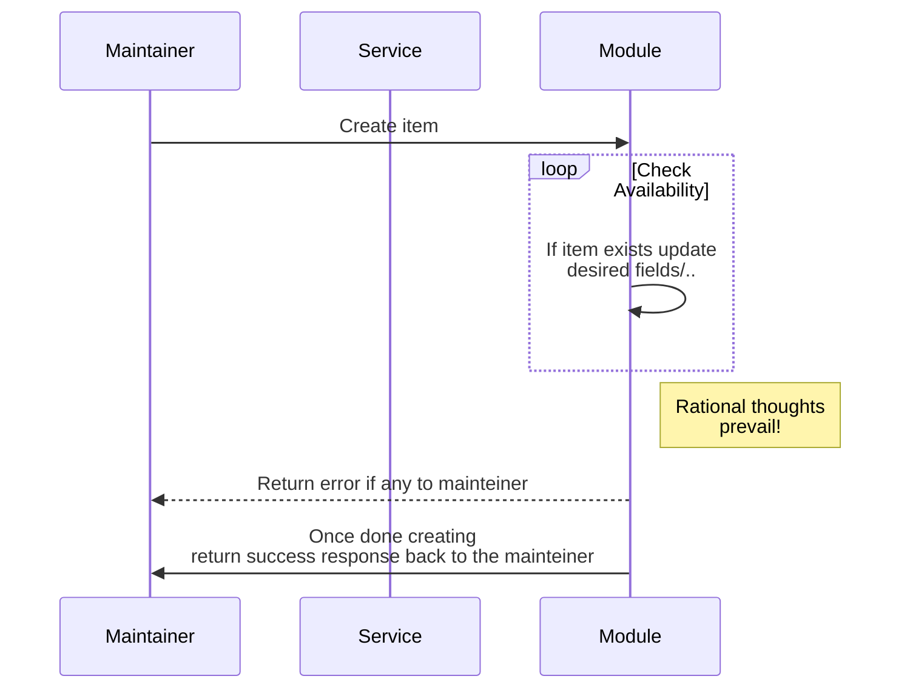
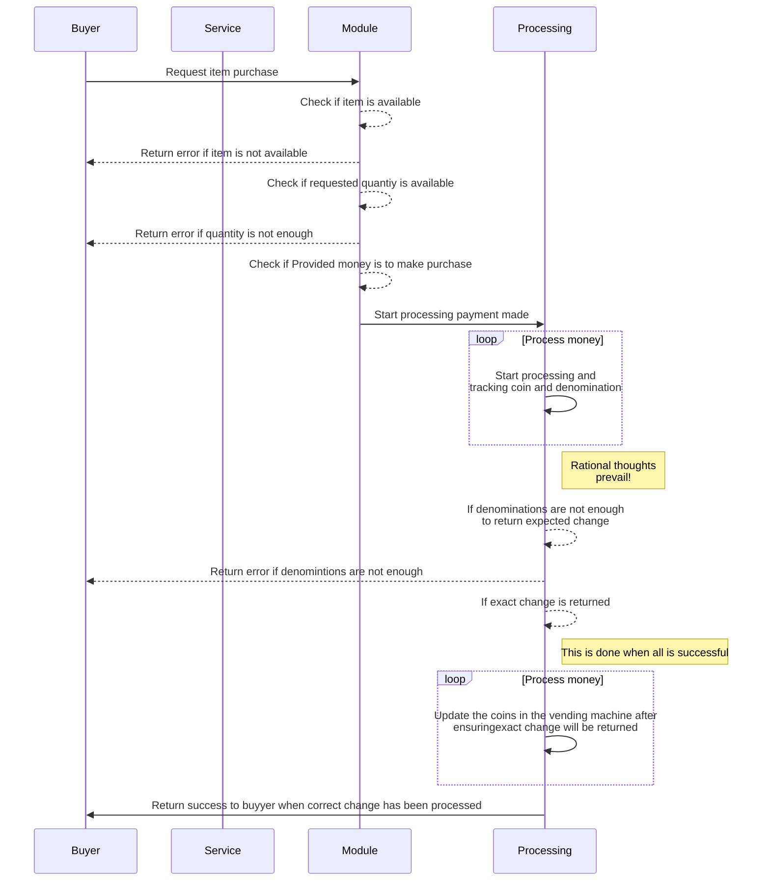

# CODE ASSIGNMENT - Pariti
## **Vending machine**

# Get started
- Clone project from [https://github.com/jayisaac0/vending-machine](https://github.com/jayisaac0/vending-machine)

- The project takes advantage of Node js fastify framework

# Setup
Clone project to your local machine
```bash
# Clone project from repository via ssl
git clone git@github.com:jayisaac0/vending-machine.git

# Clone project from repository via http
git clone https://github.com/jayisaac0/vending-machine.git

# accss project folder
cd vendine-machine

# If device has vs-code, open the project in it while in root folder
code .

# Install dependencies
npm install

# Rename example.env to .env
mv example.env .env

# Run project
npm run start

```

- To access swagger documentation interface access [http://127.0.0.1:8001/docs/static/index.html](http://127.0.0.1:8001/docs/static/index.html)

## **Swagger documentation**


To view flow install Mermaid markdown for vs code [https://marketplace.visualstudio.com/items?itemName=bierner.markdown-mermaid](https://marketplace.visualstudio.com/items?itemName=bierner.markdown-mermaid)

## **maintenance users request flow**



## **User request flow**


## **Reference**
Before development i referenced the working of a vending machine and how it handles coins inserted amd how they are output to the buyer 

[](https://youtu.be/0AkcWjB0UBE "Awesome stuff!!!")

